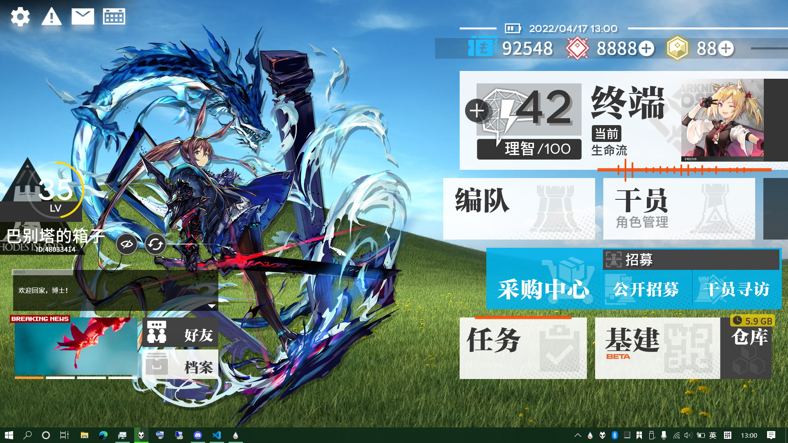

# Arknights_RMSKIN

让您在PC上也能享受到罗德岛终端系统的交互界面！

……你们没有PC吗？

# 安装与设置
首先，想办法把[字体](RMSKIN/Skins/Rhodes_Island_UI/%40Resources/Fonts/FontList.txt)弄到手，然后安装到系统或稍后置入到`Rhodes_Island_UI\@Resources\Fonts\`。

通过Releases：[下载](https://github.com/zhengzhi805/Arknights_RMSKIN/releases)`.rmskin`文件，使用Rainmeter的SkinInstaller.exe安装。

通过Sources：[下载](https://github.com/zhengzhi805/Arknights_RMSKIN/archive/refs/heads/master.zip)本存储库，将`RMSKIN`目录下的`Skins`与`Layouts`文件夹合并到Rainmeter的安装目录，刷新或重新启动Rainmeter，加载`Rhodes_Island`主题。

设置文件位于`Rainmeter\Skins\Rhodes_Island_UI\@Resources\`，编辑该目录下的`Custom.ini`与`CustomMainPanel.ini`即可对本套装进行定制，备份也没有问题。

Icon指定了图标路径；Action指定了点击操作，`[]`方括号的填写请参考Windows运行命令。

# 各Skins介绍
* Assistant

  显示您所任命助理的画像，右键可启用编辑，允许使用滚轮进行缩放。 
  子目录的AssistButton组件则提供了隐藏界面与更换助理的功能；点击更换按钮，输入助理的画像文件路径，按Enter完成更换。

* User

  显示您（或您填写的）的信息，经验值与等级为系统本次的正常运行时间。 
  子目录的Doctor组件将显示您背影的画像，同Assistant组件可启用编辑。

* VoiceBox

  语音记录文本框，但是并没有语音……（抱歉）单击可编辑文本，按Enter保存。

* Slideshow

  滚动新闻，显示指定的图片。

* ButtonCorner

  可以放在左上角或左下角（ButtonCornerLB配置）的图标按钮。

* Visualization

  音频可视化。如果你没有办法移动和编辑，记得想一想Rainmeter的管理器。

* MainPanel

  右面板整合，几乎包含了以下所有Skin组件。

* StatusBar

  显示电量、日期时间、C盘可用空间(MB)、可用内存(MB)、CPU可使用率。课金按钮将带您直达~~采购中心的硬件性价比排行榜~~任务管理器与资源监视器。（默认设置）

* Terminal

  作战终端按钮，分为Music配置与Steam配置。 
  进行设置后，前者可与~~古墓派~~**本地**音乐播放器联动显示正在播放与专辑封面；后者将显示最近运行的Steam游戏与指定的硬件温度（倒数）。

* Button/Deco/Tiny

  普普通通的按钮和有装饰线的按钮和黑白一对的按钮。

* Links

  浏览器和链接按钮，当然改成别的也行。

* Storage

  显示接入存储的状态与回收站的占用。

# 可能不是很想做的
鉴于技术有限，轮子过杂，环境不同等原因……
- [x] Storage：完成显示接入存储功能：显示可移动存储数量以及空间不足的存储数。
- [ ] Assistant：与VoiceBox联动，允许导入语音与文本，支持闲置、交谈、问候行为。
- [x] MusicTerminal配置：支持在线音乐网站从而适配猪鹅厂。（考虑使用[这个](https://github.com/tjhrulz/WebNowPlaying-BrowserExtension)）
- [ ] SteamTerminal配置：不使用外部软件实现显示硬件温度，在找到实现方法之前，暂时不做。 
如果已装有相关软件……打开`Rhodes_Island_UI\@Resources\Modules\msSteam.ini`自己动手吧。
- [ ] SteamTerminal配置：改为本地实现，显示最近运行与正在运行的游戏，目前没有头绪。
- [ ] ~~3D透视，不支持。~~
- [ ] 静态阴影。