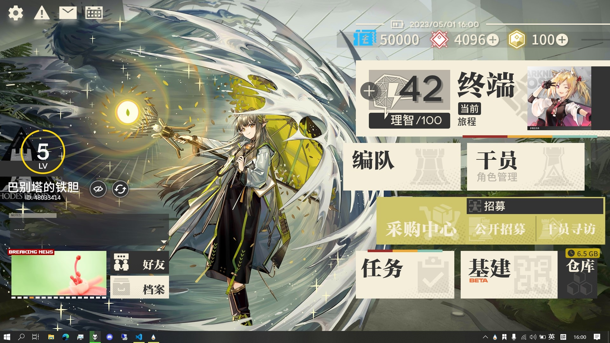

# Arknights_RMSKIN

让您在PC上也能享受到罗德岛终端系统的交互界面！

……你们没有PC吗？

## 安装与设置
### 依赖
- Rainmeter
    - [WebNowPlaying](https://github.com/tjhrulz/WebNowPlaying)插件：联动在线音乐网站的信息与控制，也需要浏览器安装[扩展](https://github.com/tjhrulz/WebNowPlaying#extension-links)。
    - [FrostedGlass](https://forum.rainmeter.net/viewtopic.php?t=23106)插件：允许皮肤以Win10的Acrylic材质为背景。
    - [MSIAfterburner](https://forums.guru3d.com/threads/319558/)插件：在特定的终端中显示指定的硬件温度。
- 游戏原作使用到的数个[字体](RMSKIN/Skins/Rhodes_Island_UI/%40Resources/Fonts/FontList.txt)

上述依赖项的懒人包：鸽了。

把字体弄到手后，安装到系统或在完成下面的步骤后置入到`Rhodes_Island_UI\@Resources\Fonts\`。

### 安装
通过Releases：[下载](https://github.com/zhengzhi805/Arknights_RMSKIN/releases)`.rmskin`文件，使用Rainmeter的SkinInstaller.exe安装。 
通过Sources：[下载](https://github.com/zhengzhi805/Arknights_RMSKIN/archive/refs/heads/master.zip)本存储库，将`RMSKIN`目录下的`Skins`与`Layouts`文件夹合并到Rainmeter的安装目录，刷新或重新启动Rainmeter，加载`Rhodes_Island`主题。

### 设置
设置文件位于`Rainmeter\Skins\Rhodes_Island_UI\@Resources\`，编辑该目录下的`Custom.ini`与`CustomMainPanel.ini`即可对本套装进行定制，备份也没有问题。 
Icon指定了图标路径；Action指定了点击操作，`[]`方括号的填写请参考Windows运行命令或Rainmeter的[Bangs命令](https://docs.rainmeter.net/manual/bangs/)。

## 各Skins介绍
- Assistant

  显示您所任命助理的画像，右键可启用编辑，允许使用滚轮进行缩放。 
  同目录下的AssistButton组件则提供了隐藏界面与更换助理的功能；点击更换按钮，输入助理的画像文件路径，按Enter完成更换。

- User

  显示您（或您填写的）的信息，经验值与等级为系统本次的正常运行时间。 
  同目录下的Doctor组件将显示您背影的画像，同Assistant组件可启用编辑。

- VoiceBox

  语音记录文本框，但是并没有语音……（抱歉）单击可编辑文本，按Enter保存。

- Slideshow

  滚动新闻，显示指定的图片。

- ButtonCorner

  可以放在左上角或左下角（ButtonCornerLB配置）的图标按钮。

- Visualization

  音频可视化。如果你没有办法移动和编辑，记得想一想Rainmeter的管理器。

- MainPanel

  右面板整合，几乎包含了以下所有Skin组件。

- StatusBar

  显示电量、日期时间、C盘可用空间(MB)、可用内存(MB)、CPU可使用率。课金按钮将带您直达~~采购中心的硬件性价比排行榜~~任务管理器与资源监视器。（默认设置）

- Terminal

  作战终端按钮，分为Music配置、Steam配置、Weather配置。 
  进行设置后，Music配置可与~~古墓派~~--本地--音乐播放器联动显示正在播放与专辑封面；Steam配置将显示最近运行的Steam游戏与指定的硬件温度（倒数）；Weather配置将显示指定地点的当前天气。

- Button/Deco/Tiny

  普普通通的按钮，有装饰线的按钮，黑白一对的按钮。

- Links

  浏览器和链接按钮，当然改成别的也行。

- Storage

  显示接入存储的状态与回收站的占用。

- IdleScreen

  在设定的时间过后显示闲置画面，如同屏幕保护程序。 
  加载`Activate.ini`即可启用此功能，画面样式位于同目录下的Skins文件夹中。

## 可能不是很想做的
鉴于技术有限，轮子过杂，环境不同等原因……
- [x] Storage：完成显示接入存储功能：显示可移动存储数量以及空间不足的存储数。
- [ ] Assistant：与VoiceBox联动，允许导入语音与文本，支持闲置、交谈、问候行为。
- [x] MusicTerminal配置：支持在线音乐网站从而适配猪鹅厂。（考虑使用[这个](https://github.com/tjhrulz/WebNowPlaying-BrowserExtension)）
- [ ] ~~SteamTerminal配置：不使用外部软件实现显示硬件温度，在找到实现方法之前，暂时不做。~~ 
看来是找不到了，如果已装有相关软件……打开`Rhodes_Island_UI\@Resources\Modules\msSysTemp.ini`自己动手吧。
- [ ] SteamTerminal配置：改为本地实现，显示最近运行与正在运行的游戏，目前没有头绪。
- [x] WeatherTerminal配置？
- [ ] Button：复刻角色管理UI，实现应用抽屉？
- [ ] 设置UI。
- [ ] ~~3D透视，不支持。~~
- [ ] 静态阴影。

## 借物表
- JDWI天气图标、JDW天气解析器
- 社区中的诸多皮肤，用于参考编写方法与技巧